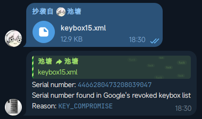

# Keybox Checker

## Deployment

You can deploy this bot yourself by using prebuilt Docker image.

```shell
docker run -d \
  --name keybox-checker \
  --restart always \
  -e API_TOKEN=YOUR_TELEGRAM_BOT_API_TOKEN \
  ghcr.io/chitang233/keybox-checker:main
```

Or, you can also deploy it from source code.

```shell
git clone https://github.com/chitang233/KeyboxChecker.git && cd KeyboxChecker
pip install -r requirements.txt
API_TOKEN=YOUR_TELEGRAM_BOT_API_TOKEN python main.py
```

## Usage

Just send a keybox file to the bot, and it will check the keybox for you.


